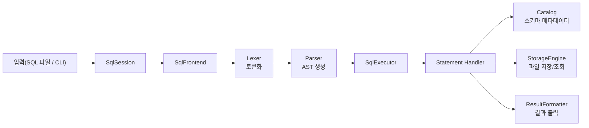
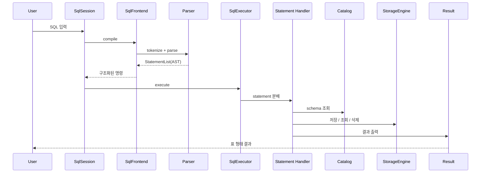

# Mini SQL Processor

C 언어로 만든 파일 기반 SQL 처리기입니다.
이번 프로젝트의 핵심 목표는 `INSERT`와 `SELECT`를 직접 구현해 보면서, SQL이 실제로 어떤 흐름으로 동작하는지 이해하는 것이었습니다.

AI를 단순 코드 생성 도구로만 쓰지 않고, **AI가 만든 코드까지 팀원 모두가 설명할 수 있을 정도로 이해하는 것**을 팀 목표로 잡고 프로젝트를 진행했습니다.

## 문서 안내

- 구조 개요: [docs/architecture.md](docs/architecture.md)
- 시스템 설계도: [docs/system-design.md](docs/system-design.md)
- 구현 계획: [docs/implementation-plan.md](docs/implementation-plan.md)
- 발표용 정리 문서: [temp_readme.md](temp_readme.md)
- 고민과 답 정리 문서: [temp_readme2.md](temp_readme2.md)

## 한눈에 보기

- 핵심 목표: `INSERT`, `SELECT`를 구현하며 SQL 처리 흐름 이해
- 입력 방식: SQL 파일 실행, 대화형 CLI 실행
- 저장 방식: `.schema` + `.data` 파일 기반 CSV 저장
- 현재 지원 명령: `CREATE TABLE`, `INSERT`, `SELECT`, `DELETE`, `DROP TABLE`
- 추가 구현:
  - 다중 `VALUES` INSERT
  - `WHERE column = value`
  - `ORDER BY`
  - `TOP N`
  - `LIMIT N`
  - `PRIMARY KEY`
  - 문자열 길이 제한 `VARCHAR(n)`, `TEXT(n)`, `CHAR(n)`
- 테스트: 단위 테스트 + 통합 테스트 + CLI 테스트

## 어떤 프로젝트인가

이 프로젝트는 SQL 문자열을 입력받아

`입력 -> 토큰화 -> 파싱(AST) -> 실행 -> 저장 / 조회`

흐름으로 처리하는 미니 SQL 엔진입니다.

최소 요구사항은 `INSERT`, `SELECT`였지만, 학습 과정에서 SQL의 구조를 더 잘 이해하기 위해 `CREATE TABLE`, `DELETE`, `DROP TABLE`까지 확장했습니다.

즉, 단순히 "동작하는 프로그램"을 만드는 것보다,

- SQL이 어떤 단계로 해석되는지
- 명령어가 어떤 구조체로 정리되는지
- 저장과 조회가 어떤 계층을 거치는지

를 팀원 모두가 설명할 수 있게 만드는 데 더 큰 의미를 두었습니다.

## 팀 목표

우리 팀의 목표는 아래 두 가지였습니다.

1. AI를 활용해 과제의 최소 구현을 빠르게 완성한다.
2. 생성된 코드를 직접 읽고 설명할 수 있을 정도로 이해한다.

즉 이번 프로젝트는

- 빠른 구현
- 구조 이해
- 코드 설명 가능성

을 동시에 가져가는 것을 목표로 했습니다.

## 개발 방식

프로젝트는 아래 방식으로 진행했습니다.

1. 팀원끼리 SQL의 기본 개념과 전체 처리 흐름을 먼저 공유했습니다.
2. 각자 AI를 활용해 최소 구현 형태를 빠르게 만들어 보았습니다.
3. 각자 만든 코드를 비교하며 어떤 구조가 더 설명하기 쉬운지 논의했습니다.
4. 이후 소스코드를 함께 읽으며, 각 파일의 역할과 로직을 직접 설명하는 시간을 가졌습니다.
5. 마지막에는 실행 흐름과 설계 고민이 README만 읽어도 보이도록 문서화했습니다.

즉 이번 프로젝트의 학습 방식은

> "AI로 빠르게 만들고, 사람이 직접 뜯어보고 설명하며 이해하는 방식"

이었습니다.

## 우리가 개발한 것

### 1. 입력 방식

- `.sql` 파일을 읽어 순차 실행
- 대화형 CLI 실행

예시:

```bash
./mini_sql --db ./db ./examples/step1.sql
./mini_sql --db ./db
```

### 2. SQL 처리 파이프라인

현재 프로젝트의 핵심 흐름은 아래와 같습니다.



한 줄로 요약하면:

> SQL 문자열을 바로 실행하지 않고, 먼저 토큰과 AST로 구조화한 뒤 실행기로 넘깁니다.

### 3. 지원 명령

#### CREATE TABLE

```sql
CREATE TABLE users (
  name TEXT,
  id INT PRIMARY KEY,
  age INT,
  track VARCHAR(20)
);
```

#### INSERT

```sql
INSERT INTO users VALUES ('Alice', 1, 24, 'backend');
INSERT INTO users VALUES ('Bob', 2, 26, 'database'), ('Carol', 3, 27, 'infra');
```

#### SELECT

```sql
SELECT * FROM users;
SELECT name, age FROM users;
SELECT name, track FROM users WHERE id = 2;
SELECT TOP 2 name, age FROM users ORDER BY age DESC;
SELECT name FROM users ORDER BY age ASC LIMIT 1;
```

#### DELETE / DROP TABLE

```sql
DELETE FROM users WHERE id = 2;
DROP TABLE users;
```

## 이 프로젝트가 보여주는 것

이번 프로젝트를 통해 직접 구현하고 확인한 핵심은 아래와 같습니다.

- SQL은 문자열을 바로 실행하는 것이 아니라, 먼저 구조화된 명령으로 바뀝니다.
- `INSERT`는 저장소에 append 하는 문제이고, `SELECT`는 저장소를 scan 하며 조건과 출력 형식을 적용하는 문제입니다.
- 스키마는 단순 컬럼 목록이 아니라 타입과 제약조건을 포함한 메타데이터입니다.
- 입력 방식과 실행 방식, 저장 방식을 분리하면 기능이 늘어나도 구조를 유지하기 쉬워집니다.

## 시스템 구조

현재 코드 구조는 아래와 같습니다.

```text
src/
├── main.c
├── app/                  # 앱 조립과 생명주기
├── session/              # 파일 실행, CLI 실행, 세션 처리
├── frontend/             # lexer, parser, AST 생성
├── executor/             # statement 실행 분배
├── executor/statements/  # INSERT/SELECT/CREATE/DELETE/DROP 실제 실행
├── catalog/              # 스키마 메타데이터 관리
├── storage/              # CSV 저장 엔진, 경로, CSV 코덱
├── result/               # SELECT 결과 출력
└── common/               # 공통 유틸리티
```

### 실행 시퀀스



## 구현하면서 고민했던 것과 현재 답

### 1. 명령어가 많아지면 어떻게 처리할 것인가

처음에는 `INSERT`, `SELECT`만 있어도 되었지만, 실제 SQL은 `WHERE`, `ORDER BY`, `TOP`, `LIMIT`, `DELETE`, `CREATE TABLE`처럼 파생 명령이 계속 늘어납니다.

그래서 현재 프로젝트는 아래 흐름을 기준으로 구조를 잡았습니다.

`입력 -> 토큰화 -> AST -> 실행기 -> 저장소`

즉 문자열을 곧바로 실행하지 않고, 먼저 구조화된 명령으로 바꾼 뒤 실행합니다.

### 2. 스키마는 어디까지 정의해야 하는가

단순 컬럼 이름만 저장하면 금방 한계가 생깁니다.
그래서 현재는 최소한 아래 정보를 스키마에 담습니다.

- 컬럼명
- 타입
- 문자열 최대 길이
- `PRIMARY KEY`

즉 스키마는 단순 이름 목록이 아니라, **제약조건이 포함된 메타데이터**입니다.

### 3. 컬럼 순서와 내부 저장 순서를 어떻게 다룰 것인가

이 부분은 구현 중 가장 많이 고민한 부분 중 하나였습니다.

사용자에게 보이는 컬럼 순서는 `CREATE TABLE`에서 정의한 순서입니다.

예:

```sql
CREATE TABLE users (name TEXT, id INT PRIMARY KEY, age INT);
```

사용자에게는 항상

```text
name | id | age
```

순서로 보여야 합니다.

하지만 내부 저장은 꼭 같은 순서일 필요는 없습니다.

현재 구현에서는 이 개념을 최소 형태로 반영했습니다.

- 스키마는 사용자 기준 컬럼 순서를 유지합니다.
- 내부 저장 엔진은 별도의 `storage slot` 순서를 가집니다.
- 현재는 `INT` 같은 고정 폭에 가까운 타입을 먼저 두고, 문자열 계열은 뒤로 배치합니다.
- 실제 `.data` 파일은 이 내부 저장 슬롯 순서로 저장됩니다.
- `SELECT` 결과를 출력할 때는 다시 스키마 순서로 복원합니다.

예를 들어:

```sql
CREATE TABLE users (name TEXT, id INT PRIMARY KEY, age INT);
INSERT INTO users VALUES ('Alice', 1, 20);
SELECT * FROM users;
```

사용자 출력은:

```text
name | id | age
Alice | 1 | 20
```

하지만 내부 저장 파일은:

```text
1,20,Alice
```

처럼 저장될 수 있습니다.

이것은 아직 완전한 binary layout이나 struct packing 최적화는 아니지만,

> "사용자 스키마 순서"와 "물리 저장 순서"를 분리하는 최소 구현

이라는 점에서 의미가 있습니다.

### 4. 패딩 바이트와 메모리 낭비 문제

C 구조체를 그대로 저장 포맷으로 쓰면 컬럼 순서에 따라 padding byte가 생기고, 사용자 스키마와 실제 메모리 배치가 엇갈릴 수 있습니다.

그래서 이번 프로젝트에서는 구조체 메모리 배치를 저장 포맷으로 직접 쓰지 않고,

- 스키마 메타데이터
- 컬럼별 문자열 배열
- 내부 저장 슬롯 순서

를 통해 논리 순서와 물리 순서를 분리하는 방향을 택했습니다.

즉 현재 답은:

> 구조체 메모리 레이아웃에 직접 의존하지 않고, 스키마와 슬롯 매핑으로 순서를 관리한다

입니다.

## 다음으로 고민해볼 것

이번 구현은 최소 동작과 구조 이해를 목표로 했기 때문에, 다음 단계에서는 아래를 고민해야 한다고 느꼈습니다.

### 1. 명령어 파서의 인터페이스화

- 토큰을 어떤 기준으로 자를 것인가
- 토큰들을 어떤 문장 구조로 조합할 것인가
- 명령어 종류가 늘어나도 파서가 깨지지 않게 하려면 어떻게 설계할 것인가

### 2. AST를 이용한 실행 구조

- 현재는 statement 단위 실행 구조이지만, 더 복잡한 AST 트리를 어떻게 다룰 것인가
- 실행 계획을 어떻게 분리할 것인가

### 3. 저장 엔진의 확장

- CSV 대신 binary row format으로 바꾼다면 어떻게 할 것인가
- B+Tree를 어떻게 구현할 것인가
- row 데이터와 index 데이터를 어떻게 분리할 것인가
- 특정 테이블을 참조하는 인덱스 테이블을 어떤 구조로 둘 것인가

### 4. 조회 성능과 인덱스 활용

- 지금은 전체 scan 기반입니다.
- 이후에는 `PRIMARY KEY`, `WHERE`, `ORDER BY`를 인덱스로 가속할 수 있어야 합니다.

즉 이번 프로젝트는 "완성된 DBMS"보다,

> 작은 SQL 처리기를 직접 구현해보고, 그 다음에 어떤 구조가 더 필요해지는지를 체감한 프로젝트

에 가깝습니다.

## 협업 방식

이번 프로젝트는 4명이 함께 진행했습니다.

핵심 협업 방식은 아래와 같았습니다.

- SQL의 기본 개념과 처리 흐름을 먼저 공유
- 각자 AI로 최소 구현을 먼저 시도
- 생성된 코드와 구조를 비교
- 실제 소스코드를 함께 읽으며 로직 설명
- 설명 가능한 구조가 되도록 다시 정리

즉 이번 협업의 핵심은 단순 분업이 아니라,

> "AI가 만든 코드를 팀원 모두가 이해하고 설명할 수 있게 만드는 과정"

에 있었습니다.

## 실행 방법

### 로컬 실행

```bash
make
./mini_sql --db ./db
```

### SQL 파일 실행

```bash
./mini_sql --db ./db ./examples/step1.sql ./examples/step2.sql
```

### Docker / Linux 환경 실행

```bash
make docker-build
make cli
```

## 마무리

이번 프로젝트는 단순히 `INSERT`, `SELECT`를 구현한 과제가 아니라,

- SQL 처리 흐름을 직접 구현해 보고
- AI가 만든 코드를 이해하고 설명하며
- 이후 B+Tree, 인덱스, 실행 계획, 저장 엔진으로 확장될 구조를 고민해 본

작은 데이터베이스 엔진 입문 프로젝트였습니다.
