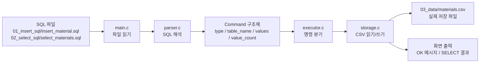

# Minini SQL Rebuild

이 폴더는 `mini_sql` 프로젝트를 **처음부터 다시 만들면서 공부하기 위한 학습용 공간**입니다.

목표는 빠르게 완성하는 것이 아니라, **한 파일씩 직접 만들고, 각 파일의 역할을 정확히 이해한 뒤 다음 단계로 넘어가는 것**입니다.

## 공부 규칙

1. 한 번에 파일 하나만 만든다.
2. 파일을 만들면 같은 폴더의 `README.md`로 그 파일의 역할을 설명한다.
3. 코드가 왜 필요한지 말로 설명할 수 있을 때 다음 단계로 간다.
4. 모르면 바로 더 작게 나눈다.
5. 지금은 "완벽한 SQL 엔진"이 아니라 "흐름을 이해하는 작은 프로그램"을 만드는 것이 목표다.

## 전체 흐름

우리가 만들 흐름은 아래와 같습니다.

1. 예제 SQL 파일을 직접 써 본다.
2. 데이터 파일(CSV)이 어떤 모양인지 이해한다.
3. 공통 구조체와 타입을 만든다.
4. 파서를 만든다.
5. 실행기를 만든다.
6. 저장소 코드를 만든다.
7. `main.c`에서 전체를 연결한다.
8. 마지막에 테스트와 문서를 정리한다.

## 흐름 다이어그램



짧게 보면 이 흐름입니다.

- `main.c`: SQL 파일 내용을 읽음
- `parser.c`: 문자열을 `Command` 구조체로 바꿈
- `executor.c`: INSERT인지 SELECT인지 보고 분기함
- `storage.c`: 실제 `materials.csv`를 읽거나 씀
- 출력: 성공 메시지나 조회 결과를 보여 줌

## 현재 시작점

지금은 **1단계: INSERT 예제 SQL 한 파일 만들기**부터 시작합니다.

현재는 학습용으로 폴더를 단계별로 나누었습니다.

- `01_insert_sql`: INSERT 입력 이해
- `02_select_sql`: SELECT 입력 이해
- `03_data`: CSV 저장 파일 이해
- `04_common`: 공통 구조체 이해
- `05_parser`: 파서 헤더 이해
- `06_storage`: 저장소 헤더 이해
- `07_executor`: 실행기 헤더 이해
- `08_parser_impl`: 파서 구현 보기
- `09_storage_impl`: 저장소 구현 보기
- `10_executor_impl`: 실행기 구현 보기
- `11_main`: 전체 연결 흐름 보기
- `12_tests`: 빌드와 테스트 보기

## 실행 방법

```bash
make
./mini_sql_rebuild 01_insert_sql/insert_material.sql
./mini_sql_rebuild 02_select_sql/select_materials.sql
```
