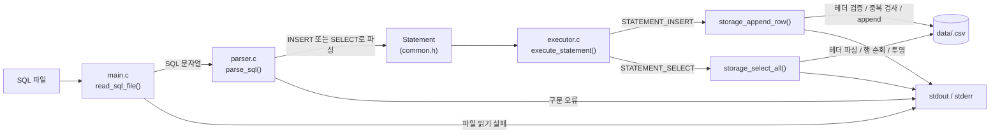
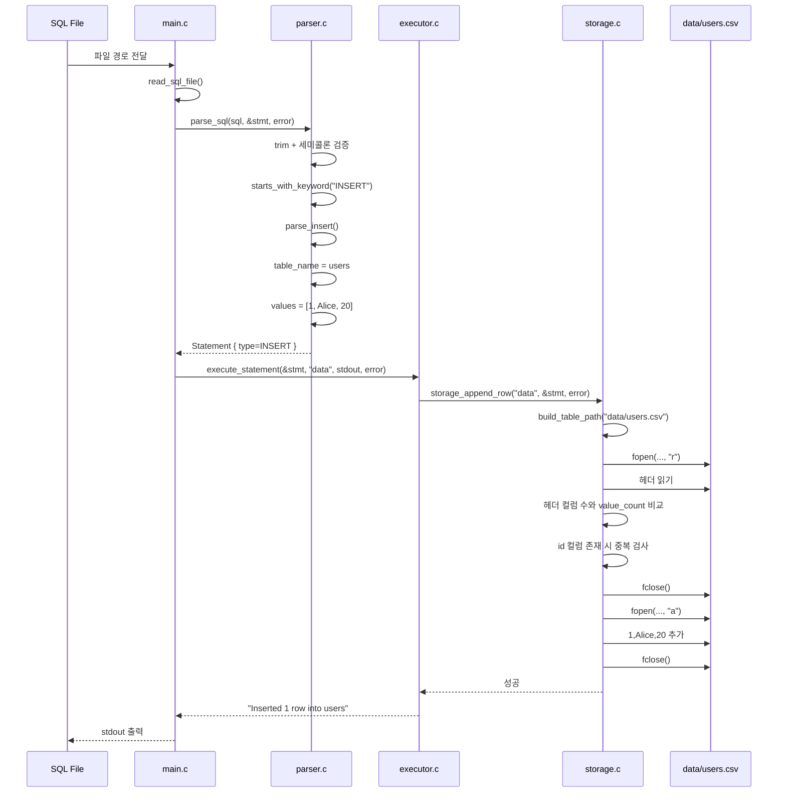
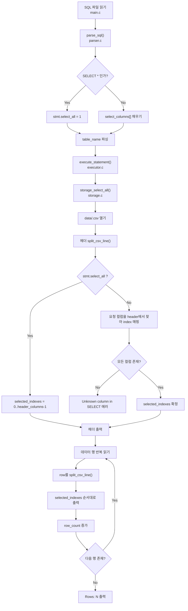

# SQL Processor Diagrams

이 문서는 현재 코드 기준으로 SQL Processor의 핵심 흐름을 다이어그램으로 정리한 것입니다.
기준 파일은 [main.c](/Users/juhoseok/Desktop/sql_processor/main.c), [parser.c](/Users/juhoseok/Desktop/sql_processor/parser.c), [executor.c](/Users/juhoseok/Desktop/sql_processor/executor.c), [storage.c](/Users/juhoseok/Desktop/sql_processor/storage.c) 입니다.

## 1. 전체 시스템 다이어그램

핵심 구조:

- `main.c`는 파일을 읽고 파싱과 실행을 연결합니다.
- `parser.c`는 SQL을 `Statement`라는 중간 표현으로 바꿉니다.
- `executor.c`는 `Statement.type`으로 `INSERT`와 `SELECT`를 분기합니다.
- `storage.c`는 실제 CSV 파일 입출력과 검증을 담당합니다.

## 2. INSERT 다이어그램

예시 SQL: `INSERT INTO users VALUES (1, 'Alice', 20);`

INSERT에서 중요한 검증:

- 테이블 파일이 없으면 실패합니다.
- 헤더 컬럼 수와 `VALUES` 개수가 다르면 실패합니다.
- 헤더에 `id` 컬럼이 있으면 기존 모든 행을 읽어 중복을 검사합니다.

## 3. SELECT 다이어그램

예시 SQL:

- `SELECT * FROM users;`
- `SELECT name, id FROM users;`

SELECT에서 중요한 포인트:

- 실제 조회는 모두 `storage_select_all()` 하나가 담당합니다.
- `SELECT *`면 헤더의 모든 컬럼 인덱스를 그대로 사용합니다.
- 컬럼 지정 조회면 `find_column_index()`로 헤더에서 위치를 찾아 원하는 순서대로 출력합니다.
- 마지막에 항상 `Rows: N`을 출력합니다.
