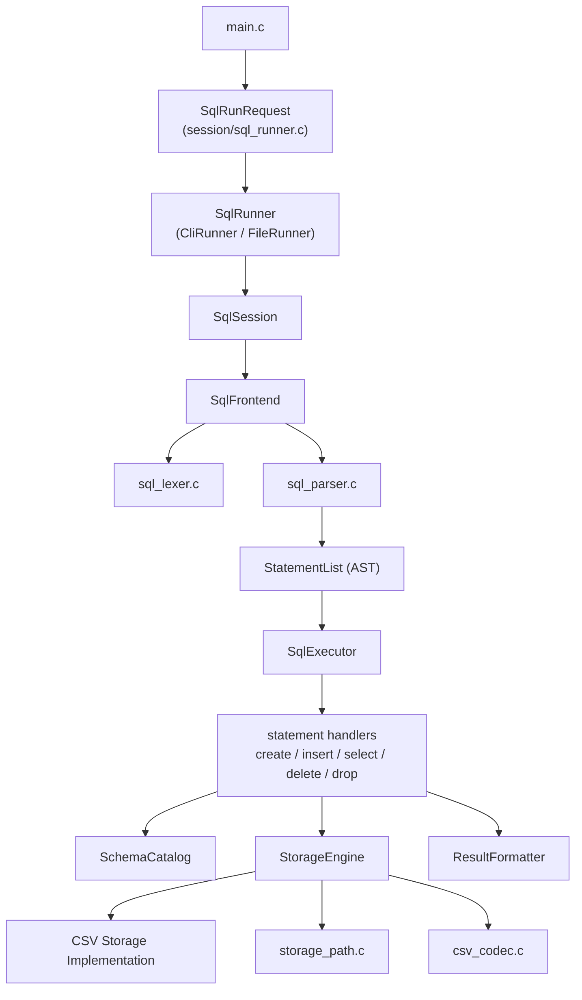

# 구조 개요

이 문서는 현재 `mini_sql` 프로젝트의 전체 구조를 빠르게 파악하기 위한 아키텍처 문서입니다.

핵심 철학은 아래 두 가지입니다.

1. 입력 방식과 SQL 실행 로직을 분리합니다.
2. 조건문 나열보다 인터페이스와 디스패치 테이블로 흐름을 연결합니다.

## 한 줄 구조

`입력 -> SqlRunRequest -> SqlRunner -> SqlSession -> SqlFrontend -> StatementList(AST) -> SqlExecutor -> Catalog/Storage/Result`

## 디렉터리 책임

| 디렉터리 | 책임 |
| --- | --- |
| `src/app` | 앱 조립과 생명주기 관리 |
| `src/session` | 실행 요청 파싱, CLI 실행기, 파일 실행기, 세션 실행 흐름 |
| `src/frontend` | SQL 문자열을 토큰과 AST로 변환 |
| `src/executor` | AST를 문장 종류별 실행기로 분배 |
| `src/executor/statements` | `CREATE/INSERT/SELECT/DELETE/DROP` 실제 실행 |
| `src/catalog` | 스키마 메타데이터 로드/저장 |
| `src/storage` | 저장 엔진 인터페이스와 CSV 기반 구현 |
| `src/result` | 조회 결과 출력 포맷 |
| `src/common` | 공통 유틸리티 |
| `include` | 공용 타입과 공개 인터페이스 |

## 모듈 구조도

## 계층별 설명

### 1. App

- `SqlApp`은 객체 조립만 담당합니다.
- 세션, 프런트엔드, 실행기, 저장 엔진을 묶어 실행 가능한 런타임을 만듭니다.
- 실제 SQL 문자열을 직접 처리하지 않습니다.

관련 파일:

- `/Users/woonyong/workspace/Krafton-Jungle/jungle-week6-SQL/src/app/sql_app.c`

### 2. Session

- `SqlRunRequest`는 `argv`를 실행 요청 객체로 정규화합니다.
- `SqlRunner`는 입력 방식별 실행 인터페이스입니다.
- 현재 구현체는 `CliRunner`, `FileRunner` 두 개입니다.
- `SqlSession`은 입력 하나를 `compile -> execute` 흐름으로 처리합니다.

관련 파일:

- `/Users/woonyong/workspace/Krafton-Jungle/jungle-week6-SQL/src/session/sql_runner.c`
- `/Users/woonyong/workspace/Krafton-Jungle/jungle-week6-SQL/src/session/sql_cli.c`
- `/Users/woonyong/workspace/Krafton-Jungle/jungle-week6-SQL/src/session/sql_session.c`

### 3. Frontend

- `SqlFrontend`는 SQL 문자열을 AST로 바꾸는 해석 계층입니다.
- 내부적으로 `lexer -> parser` 순서로 동작합니다.
- 실행은 하지 않습니다.

관련 파일:

- `/Users/woonyong/workspace/Krafton-Jungle/jungle-week6-SQL/src/frontend/sql_frontend.c`
- `/Users/woonyong/workspace/Krafton-Jungle/jungle-week6-SQL/src/frontend/sql_lexer.c`
- `/Users/woonyong/workspace/Krafton-Jungle/jungle-week6-SQL/src/frontend/sql_parser.c`

### 4. Executor

- `SqlExecutor`는 AST 목록을 순서대로 실행합니다.
- 문장 종류별 분배는 핸들러 테이블이 담당합니다.
- 실제 파일 입출력은 statement 파일과 저장 엔진으로 위임합니다.

관련 파일:

- `/Users/woonyong/workspace/Krafton-Jungle/jungle-week6-SQL/src/executor/sql_executor.c`
- `/Users/woonyong/workspace/Krafton-Jungle/jungle-week6-SQL/src/executor/statements/`

### 5. Catalog

- 스키마 메타데이터를 `.schema` 파일에서 읽고 저장합니다.
- 실행 계층은 컬럼 정보를 직접 파싱하지 않고 catalog 계층을 이용합니다.

관련 파일:

- `/Users/woonyong/workspace/Krafton-Jungle/jungle-week6-SQL/src/catalog/schema_catalog.c`

### 6. Storage

- `StorageEngine`은 저장 방식 인터페이스입니다.
- 현재 구현은 CSV 기반 파일 저장 하나만 연결되어 있습니다.
- 저장 엔진 생성은 레지스트리 테이블로 선택합니다.

관련 파일:

- `/Users/woonyong/workspace/Krafton-Jungle/jungle-week6-SQL/src/storage/storage_engine.c`
- `/Users/woonyong/workspace/Krafton-Jungle/jungle-week6-SQL/src/storage/storage_path.c`
- `/Users/woonyong/workspace/Krafton-Jungle/jungle-week6-SQL/src/storage/csv_codec.c`

### 7. Result

- `SELECT` 결과를 ASCII 표 형식으로 출력합니다.
- 추후 JSON/CSV 포맷터를 붙일 수 있게 인터페이스 경계를 유지하고 있습니다.

관련 파일:

- `/Users/woonyong/workspace/Krafton-Jungle/jungle-week6-SQL/src/result/result_table.c`

## 인터페이스 중심 설계 포인트

### SqlRunner

- 입력 모드가 무엇인지 `main`이 몰라도 됩니다.
- `sql_runner_run()`만 호출하면 됩니다.

### SqlSession

- CLI, 파일, 향후 소켓 입력이 모두 같은 세션 경로를 재사용할 수 있습니다.
- 입력 출처가 달라도 `SqlInput`만 맞으면 처리할 수 있습니다.

### SqlExecutor

- 문장 실행 분배는 핸들러 테이블로 연결합니다.
- 문장 종류 추가 시 실행기 전체를 수정하지 않고 핸들러 등록만 늘리면 됩니다.

### StorageEngine

- SQL 계층은 저장 포맷이 CSV인지 다른 포맷인지 모릅니다.
- 현재는 CSV 구현만 연결되어 있지만, 구조상 새 저장 엔진을 추가할 수 있습니다.

## 현재 구현 범위

- 실행 입력: CLI, `.sql` 파일
- 지원 문장: `CREATE TABLE`, `INSERT`, `SELECT`, `DELETE`, `DROP TABLE`
- 저장 구현: CSV 파일 기반 저장 엔진

## 확장 포인트

아래 확장은 구조상 들어갈 자리가 이미 정해져 있습니다.

- 새 입력 방식 추가: `SqlRunner` 구현체 추가
- 새 저장 방식 추가: `StorageEngine` 구현체 추가
- 새 SQL 문장 추가: parser 등록 + executor handler 추가 + statement 파일 추가
- 결과 포맷 추가: `ResultFormatter` 구현 추가
