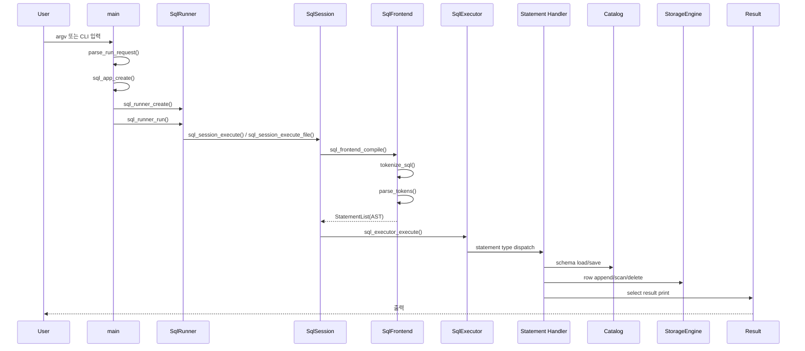
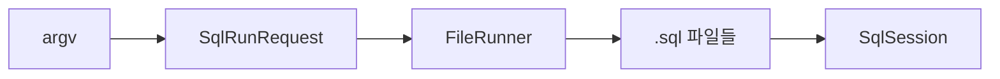
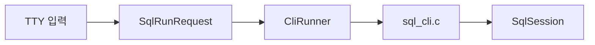
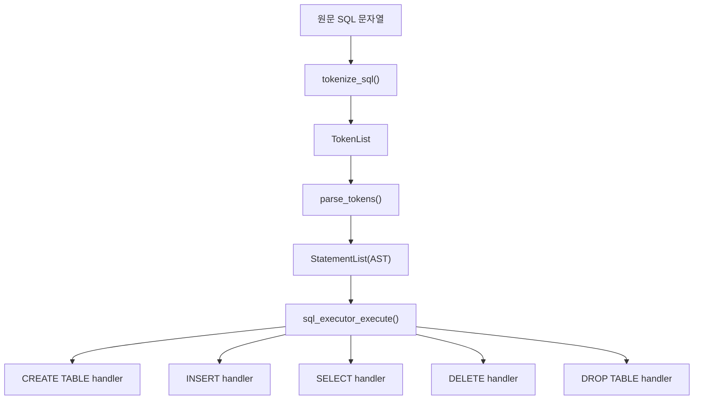
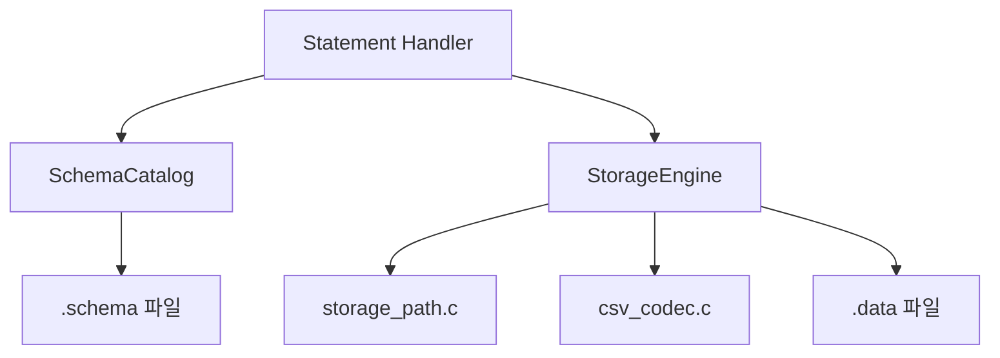

# 시스템 설계도

이 문서는 요청 하나가 들어와 실제 파일 저장/조회까지 이어지는 시스템 설계를 설명합니다.

## 1. 실행 시퀀스

현재 입력 경로는 두 가지입니다.

- SQL 파일 실행
- 대화형 CLI 실행

둘 다 최종적으로는 같은 `SqlSession` 실행 경로로 합쳐집니다.

## 2. 전체 시퀀스 다이어그램



## 3. 입력별 동작 구조

### 파일 실행



### CLI 실행



## 4. SQL 처리 파이프라인



## 5. 저장소 설계

현재 저장 엔진은 CSV 기반 파일 저장입니다.

### 물리 파일 구조

```text
db/
├── users.schema
├── users.data
└── analytics/
    ├── events.schema
    └── events.data
```

### 저장 구조도



### 스키마 파일

- 테이블 컬럼명과 타입을 저장합니다.
- `CREATE TABLE` 시 생성됩니다.
- `INSERT`, `SELECT`, `DELETE` 시 컬럼 정합성 확인에 사용됩니다.

### 데이터 파일

- 각 행을 CSV 형식으로 저장합니다.
- `INSERT` 시 append 됩니다.
- `SELECT` 시 순차 스캔합니다.
- `DELETE` 시 임시 파일 재작성 후 교체합니다.

## 6. 인터페이스 설계 포인트

### A. 입력과 실행 분리

- `SqlRunner`는 입력 방식별 실행기 인터페이스입니다.
- `main`은 실행기가 CLI인지 파일인지 모릅니다.
- `sql_runner_run()`만 호출합니다.

### B. 해석과 실행 분리

- `SqlFrontend`는 문자열을 AST로 바꾸기만 합니다.
- `SqlExecutor`는 AST를 실행하기만 합니다.
- 따라서 parser가 파일 저장을 모르고, storage가 토큰화를 몰라도 됩니다.

### C. 실행과 저장 분리

- statement handler는 저장 방식 자체를 모릅니다.
- `StorageEngine` 인터페이스만 통해 접근합니다.
- 현재 구현은 CSV지만, 구조적으로는 다른 엔진을 붙일 수 있습니다.

## 7. 현재 조건문을 줄인 지점

이번 구조 정리에서 특히 아래 부분을 조건문 나열보다 등록형 구조로 옮겼습니다.

- 문장 파싱 분배: 토큰 타입 -> statement parser 디스패치 테이블
- 저장 엔진 선택: `StorageEngineKind` -> 저장 엔진 팩토리 테이블
- 실행기 선택: `SqlRunMode` -> runner factory 테이블

즉, 지금 구조는 `if/else` 체인보다 아래 형태를 더 우선합니다.

`종류 -> 등록 테이블 -> 구현 함수`

## 8. 현재 구현과 확장 여지

### 현재 구현

- `CliRunner`
- `FileRunner`
- `CSV StorageEngine`
- `ASCII ResultFormatter`

### 확장 가능한 자리

- `SocketRunner`
- `UpdateLoopRunner`
- `BinaryStorageEngine`
- `BPlusTreeStorageEngine`
- `JsonResultFormatter`

현재는 실제 구현을 넣지 않았고, 구조상 어디에 붙어야 하는지만 명확히 남겨둔 상태입니다.

## 9. 읽는 순서 추천

구조를 빠르게 이해하려면 아래 순서가 가장 좋습니다.

1. `/Users/woonyong/workspace/Krafton-Jungle/jungle-week6-SQL/src/main.c`
2. `/Users/woonyong/workspace/Krafton-Jungle/jungle-week6-SQL/src/session/sql_runner.c`
3. `/Users/woonyong/workspace/Krafton-Jungle/jungle-week6-SQL/src/session/sql_session.c`
4. `/Users/woonyong/workspace/Krafton-Jungle/jungle-week6-SQL/src/frontend/sql_frontend.c`
5. `/Users/woonyong/workspace/Krafton-Jungle/jungle-week6-SQL/src/frontend/sql_lexer.c`
6. `/Users/woonyong/workspace/Krafton-Jungle/jungle-week6-SQL/src/frontend/sql_parser.c`
7. `/Users/woonyong/workspace/Krafton-Jungle/jungle-week6-SQL/src/executor/sql_executor.c`
8. `/Users/woonyong/workspace/Krafton-Jungle/jungle-week6-SQL/src/executor/statements/`
9. `/Users/woonyong/workspace/Krafton-Jungle/jungle-week6-SQL/src/catalog/schema_catalog.c`
10. `/Users/woonyong/workspace/Krafton-Jungle/jungle-week6-SQL/src/storage/storage_engine.c`
