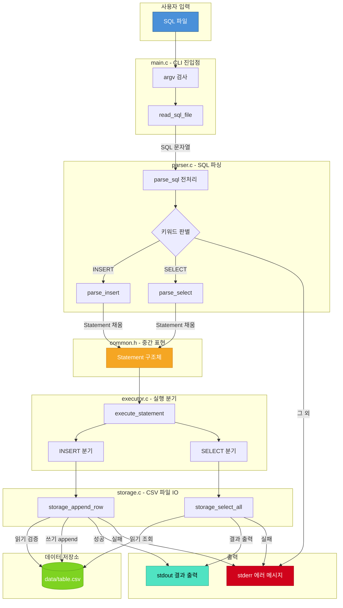
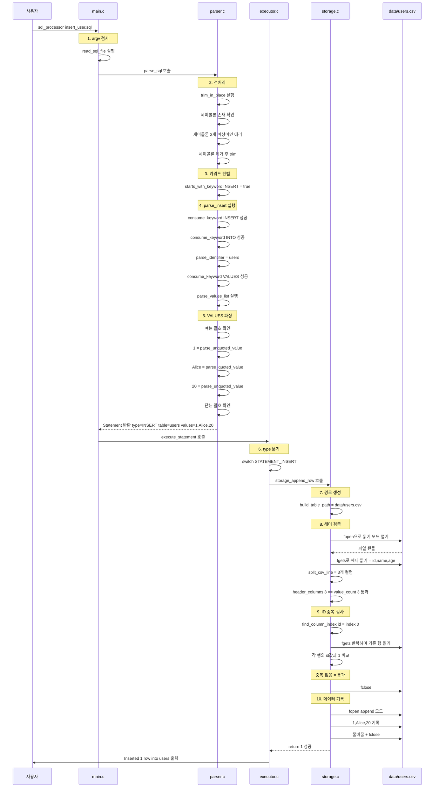
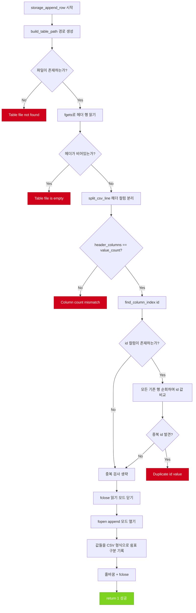
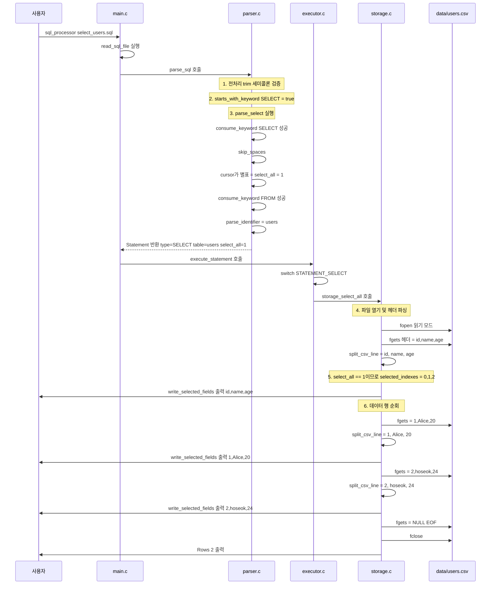
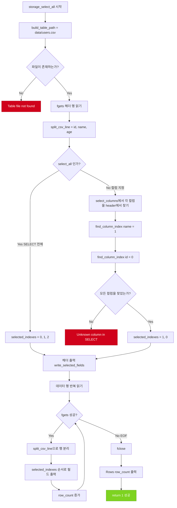
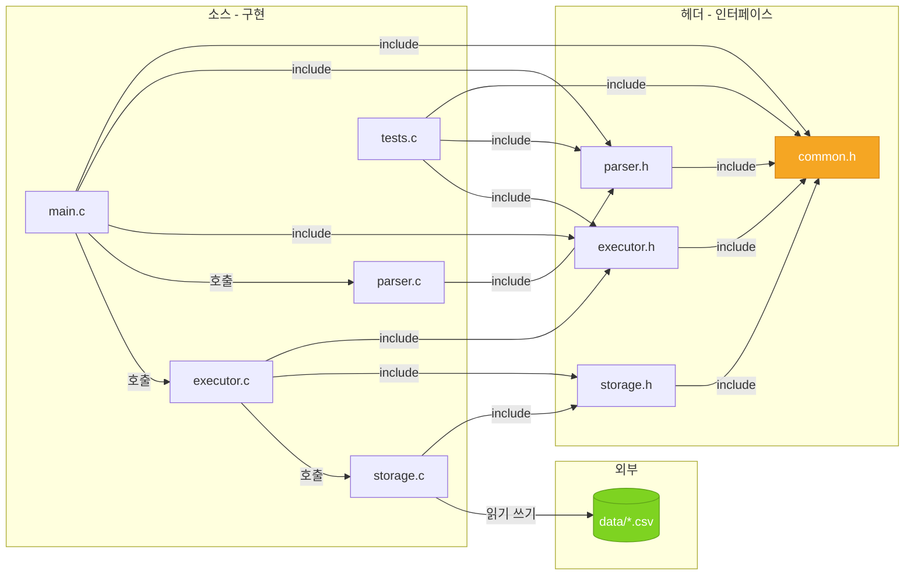
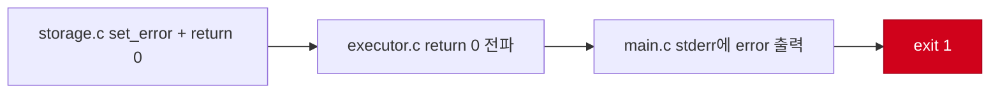

# SQL Processor 프로젝트 전체 분석

## 📌 프로젝트 개요

파일 기반 SQL 처리기 MVP로, SQL 파일을 입력받아 **파싱 → 실행 → CSV 저장/조회**를 수행하는 C 프로그램입니다.
핵심 목표는 DBMS의 전체 흐름(입력 → 파싱 → 실행 → 저장)을 학습용으로 보여주는 것입니다.

---

## 📁 프로젝트 구조

| 파일 | 역할 | 주요 함수 |
|------|------|-----------|
| `main.c` | CLI 진입점, SQL 파일 읽기 | `main()`, `read_sql_file()` |
| `common.h` | 공통 상수, Statement 구조체 정의 | — |
| `parser.h` / `parser.c` | SQL 문자열 → Statement 구조체 변환 | `parse_sql()`, `parse_insert()`, `parse_select()` |
| `executor.h` / `executor.c` | Statement를 보고 storage 함수 호출 | `execute_statement()` |
| `storage.h` / `storage.c` | CSV 파일 읽기/쓰기, 데이터 검증 | `storage_append_row()`, `storage_select_all()` |
| `tests.c` | 단위/통합 테스트 11개 케이스 | `test_*()` 함수들 |
| `Makefile` | 빌드/테스트 자동화 | `make`, `make test`, `make clean` |
| `data/users.csv` | 테이블 데이터, 첫 줄이 스키마 | — |

---

## 🧱 핵심 자료구조: Statement

모든 모듈 사이의 **데이터 전달 매개체**로 사용됩니다. Parser가 채우고, Executor와 Storage가 읽습니다.

```c
typedef struct Statement {
    StatementType type;                                    // INSERT or SELECT
    char table_name[64];                                   // 대상 테이블 이름
    int value_count;                                       // INSERT 값 개수
    char values[16][128];                                  // INSERT 값 배열
    int select_all;                                        // SELECT * 여부 (1 = *, 0 = 컬럼 지정)
    int select_column_count;                               // 선택된 컬럼 수
    char select_columns[16][64];                           // 선택된 컬럼 이름 배열
} Statement;
```

> **핵심**: `Statement`는 이 시스템의 **중간 표현(IR)**입니다. Parser → Executor → Storage 세 계층을 연결하는 유일한 데이터 구조입니다.

---

## 1️⃣ 전체 시스템 아키텍처 다이어그램



### 계층 요약

| 계층 | 파일 | 역할 |
|------|------|------|
| **입력 계층** | `main.c` | CLI 인자 검사, SQL 파일 읽기 |
| **파싱 계층** | `parser.c` | SQL 문자열 → Statement 변환 |
| **실행 계층** | `executor.c` | Statement type 분기, storage 호출 |
| **저장 계층** | `storage.c` | CSV 파일 읽기/쓰기, 데이터 검증 |
| **데이터** | `data/*.csv` | CSV 형식의 테이블 파일 |

---

## 2️⃣ INSERT 흐름 다이어그램

`INSERT INTO users VALUES (1, 'Alice', 20);` 실행 시의 전체 흐름입니다.



### INSERT 세부 흐름 — 검증 로직



---

## 3️⃣ SELECT 흐름 다이어그램

### SELECT * 흐름

`SELECT * FROM users;` 실행 시의 전체 흐름입니다.



### SELECT 컬럼 지정 흐름

`SELECT name, id FROM users;` — 컬럼 프로젝션(Column Projection) 동작 방식



### 컬럼 프로젝션 예시

```
헤더:  id(0), name(1), age(2)
요청:  SELECT name, id FROM users;

selected_indexes = [1, 0]

CSV 행: 1,Alice,20
        ↓ index 1 → "Alice"
        ↓ index 0 → "1"
출력:   Alice,1
```

---

## 🔄 모듈 간 의존 관계



> **단방향 의존**: `main.c` → `parser.c` → (없음), `main.c` → `executor.c` → `storage.c` → CSV.
> Parser와 Storage는 서로 모르며, Executor가 둘을 연결합니다.

---

## 🧪 테스트 구조

| # | 테스트 함수 | 검증 대상 | 계층 |
|---|-----------|----------|------|
| 1 | `test_parse_insert_case_insensitive` | 소문자 insert 파싱 | Parser |
| 2 | `test_parse_select_specific_columns` | 컬럼 지정 SELECT 파싱 | Parser |
| 3 | `test_insert_and_select_flow` | INSERT → SELECT 통합 흐름 | 전체 |
| 4 | `test_select_specific_columns_flow` | 컬럼 프로젝션 통합 흐름 | 전체 |
| 5 | `test_invalid_insert_syntax` | INSERT users VALUES 에러 | Parser |
| 6 | `test_invalid_select_syntax` | SELECT users 에러 | Parser |
| 7 | `test_missing_semicolon` | 세미콜론 누락 에러 | Parser |
| 8 | `test_missing_table_file` | 존재하지 않는 테이블 파일 | Storage |
| 9 | `test_empty_sql_input` | 빈 SQL 입력 | Parser |
| 10 | `test_column_count_mismatch` | 헤더/값 개수 불일치 | Storage |
| 11 | `test_duplicate_id_insert` | ID 중복 검사 | Storage |

---

## 📊 에러 처리 흐름

모든 계층에서 int 반환값(1=성공, 0=실패)과 char error 버퍼를 사용한 **일관된 에러 전파** 패턴:



각 함수는 실패 시 error 버퍼에 메시지를 쓰고 return 0을 하며, 호출자가 이를 체크하여 상위로 전파합니다. 최종적으로 main.c가 stderr에 출력하고 종료합니다.
