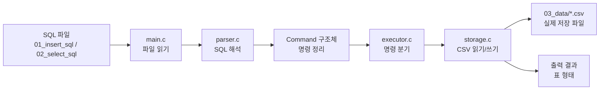
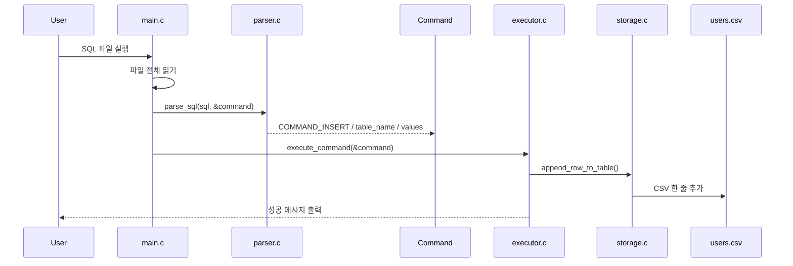
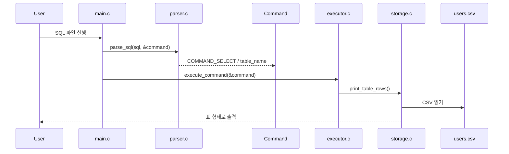

# Mini SQL Processor

SQL 파일을 입력받아 `INSERT`, `SELECT`를 해석하고, CSV 파일에 저장·조회하는 미니 SQL 처리기입니다.
저희 팀은 "빠르게 만드는 것"과 동시에 **"만들어진 소스코드를 팀원 모두가 설명할 수 있을 정도로 이해하는 것"** 을 목표로 이 프로젝트에 임했습니다.

> 발표 기준 브랜치: `huiugim8`
> 확장 설계 참고 브랜치: `woonyong-kr`

---

## 1. 어떤 프로젝트인가요

저희가 만든 건 **C 언어로 구현한 파일 기반 미니 SQL 처리기**입니다.

텍스트 파일에 SQL 문장을 써서 실행하면, 프로그램이 이를 읽어 아래 순서로 처리합니다.

```
입력(SQL 파일) → 파싱 → 명령 구조체로 정리 → 실행 → CSV 파일 저장 / 조회 출력
```

발표 기준인 `huiugim8` 브랜치는 과제의 최소 요구사항에 맞춘 **학습용 재구현 버전**으로, "동작하는 최소 SQL 처리기를 직접 다시 만들어 보면서 흐름을 이해하는 것"에 집중했습니다.

지원하는 기능은 아래와 같습니다.

- `INSERT INTO ... VALUES (...)`
- `SELECT * FROM ...`
- CSV 기반 파일 저장 / 읽기
- SQL 파일 입력 실행
- 빌드 및 기능 검증 테스트 스크립트

---

## 2. 팀 목표

저희 팀 목표는 단순히 결과물을 제출하는 게 아니라, **제안된 과제를 소스코드 수준까지 이해하는 것**이었습니다.

접근 방식은 이렇습니다.

먼저 SQL의 가장 기본 개념을 팀원끼리 공유하는 시간을 가졌고, 이후 각자 AI를 활용해 최소 구현 형태를 빠르게 만들어 봤습니다. 만들어진 코드를 모여서 함께 분석하며 "이 코드가 왜 이렇게 동작하는지"를 서로 설명하는 시간을 가졌고, 마지막엔 흐름이 눈에 보이도록 구조를 다시 정리하는 단계까지 진행했습니다.

정리하자면, 이번 프로젝트는 **"AI를 활용한 빠른 구현"과 "직접 설명 가능한 수준의 이해"** 를 함께 가져가는 것이 핵심이었습니다.

---

## 3. 전체 로직 구조

핵심 실행 흐름을 다이어그램으로 보면 아래와 같습니다.



한 줄로 요약하면:

> `입력(SQL)` → `파싱` → `명령 구조화` → `실행` → `저장 / 출력`

---

## 4. 코드 구조

폴더를 단계별로 나눠서, SQL 처리기의 흐름을 한 단계씩 이해할 수 있게 구성했습니다.

```text
01_insert_sql      INSERT 예제 SQL
02_select_sql      SELECT 예제 SQL
03_data            CSV 데이터 파일
04_common          공통 구조체와 타입
05_parser          파서 인터페이스
06_storage         저장소 인터페이스
07_executor        실행기 인터페이스
08_parser_impl     파서 구현
09_storage_impl    저장소 구현
10_executor_impl   실행기 구현
11_main            전체 연결
12_tests           테스트 스크립트
```

이 구조는 "큰 프로그램을 한 번에 이해하려 하지 말고, 파일 하나씩 역할을 분리해서 이해하자"는 학습 목적에서 잡은 방향입니다.

---

## 5. 핵심 자료구조

현재 구현에서 가장 중요한 구조체는 `Command`입니다.

`04_common/common.h`

```c
typedef enum {
    COMMAND_UNKNOWN = 0,
    COMMAND_INSERT,
    COMMAND_SELECT
} CommandType;

typedef struct {
    CommandType type;
    char table_name[MAX_TABLE_NAME_LENGTH];
    char values[MAX_VALUES][128];
    int value_count;
} Command;
```

이 구조체는 문자열 SQL을 실행 가능한 명령으로 바꾸는 **중간 표현**입니다. 파서와 실행기가 서로 문자열을 다시 해석하지 않고, 같은 구조체를 공유하면서 연결될 수 있게 해주는 핵심 역할을 합니다.

---

## 6. 실제 동작 흐름

예를 들어 아래 SQL이 들어오면:

```sql
INSERT INTO users VALUES ('kim', 20);
```

프로그램 내부는 이렇게 흘러갑니다.



`SELECT`는 반대 방향입니다.



---

## 7. 테스트와 검증

과제 요구사항에서 "테스트를 반드시 작성하고 검증 내용을 발표에 포함하라"고 했습니다. 저희는 간단한 기능 테스트 스크립트를 포함했습니다.

`12_tests/test.sh`

테스트 흐름은 이렇습니다.

1. 기존 CSV를 백업합니다.
2. 테스트용 데이터로 초기화합니다.
3. 빌드합니다.
4. INSERT를 실행합니다.
5. SELECT로 조회합니다.
6. 종료 시 원본 데이터를 복원합니다.

단순히 실행이 되는지 보는 게 아니라, **입력 → 저장 → 조회** 전체 흐름이 실제로 동작하는지 검증하는 구조입니다.

---

## 8. 협업 방식

4명이 함께 진행했고, 협업 방식은 이랬습니다.

먼저 SQL의 기본 개념을 짧게 팀원끼리 정리했습니다. 이후 각자 AI를 활용해 최소 구현을 빠르게 만들어 봤고, 만들어진 코드들을 비교하면서 어떤 흐름이 더 설명하기 쉬운지 논의했습니다. 그 다음엔 파일을 역할별로 다시 나눠서, 한 파일씩 읽으면서 로직을 직접 설명하는 학습 시간을 가졌습니다.

이번 협업에서 핵심은 단순한 분업이 아니라, **코드를 설명하고 검증하는 과정 자체를 함께 수행한 것**이었습니다.

---

## 9. 구현하면서 든 고민들

이 프로젝트를 학습하면서 단순 구현 이상으로 여러 구조적 고민이 생겼습니다.

### 명령어가 늘어나면 어떻게 처리할 것인가

처음엔 `INSERT`, `SELECT` 두 가지뿐이라 단순 분기로 충분했습니다. 그런데 실제 SQL은 그렇지 않죠. `SELECT WHERE`, `SELECT ORDER BY`, `DELETE`, `UPDATE`, `CREATE TABLE`처럼 하나의 명령에서 파생되는 문법이 계속 늘어납니다.

명령이 늘어날수록 단순 `if` 분기만으로는 유지보수가 점점 힘들어집니다. 그래서 입력을 어떤 구조체로 정리할지, 실행기 인터페이스를 어떻게 설계할지, 저장 계층과 해석 계층을 어떻게 분리할지를 고민하게 됐습니다. `woonyong-kr` 브랜치에서는 이 고민을 vtable 기반 인터페이스 구조로 실험해봤습니다.

### 스키마 단계에서 규칙을 어디까지 정의해야 하는가

현재 발표 브랜치는 최소 구현이라 스키마를 단순하게 가정하고 있습니다. 하지만 실제론 `PRIMARY KEY`, `NOT NULL`, 문자열 길이 제한, 타입 검증 같은 규칙들이 필요하고, "테이블을 만들 때 정의한 규칙"이 실행 단계에서도 일관되게 적용되어야 합니다. 이 지점에서 스키마 메타데이터를 별도로 관리하는 구조가 필요하다고 느꼈습니다.

### 구조체 메모리 표현과 컬럼 순서 문제

스키마 컬럼 순서와 C 구조체의 실제 메모리 배치는 다를 수 있습니다. 예를 들어 사용자는 `id, name, age` 순서로 정의했는데, 메모리 효율을 위해 내부 구조체가 다른 순서로 재배치될 수 있습니다. 그렇다면 내부 저장 순서, 사용자에게 보여주는 순서, 파일에 저장하는 순서를 어떻게 분리해 관리해야 할지 고민이 생겼습니다. 구조체 패딩 바이트 문제까지 고려하면, "사용자 스키마"와 "내부 물리 표현"을 구분하는 설계가 필요하다는 생각이 들었습니다.

### 저장 방식은 결국 어떻게 확장할 것인가

현재는 CSV 저장이 가장 단순하고 학습하기 좋습니다. 그런데 다음 단계로 가면 자연스럽게 이런 질문들이 생깁니다. CSV의 한계는 무엇인가, 이진 포맷으로 바꾸면 무엇이 달라지는가, 인덱스가 필요하다면 B+Tree는 어떻게 설계해야 하는가. 이번 프로젝트는 단순한 SQL 처리기 과제였지만, 실제론 데이터베이스 내부 구조에 대한 고민까지 이어질 수 있는 출발점이었습니다.

---

## 10. 두 브랜치 비교

| | `huiugim8` (발표 기준) | `woonyong-kr` (확장 설계) |
|---|---|---|
| 목적 | 흐름 이해용 최소 구현 | 구조 고민을 반영한 확장 설계 |
| SQL | `INSERT`, `SELECT` | `INSERT`, `SELECT`, `CREATE TABLE`, `DELETE`, `DROP TABLE` |
| 구조 | 단계별 폴더 분리 | 레이어별 모듈 분리 (`src/` 트리) |
| 실행 방식 | SQL 파일 입력 | 파일 입력 + 대화형 CLI |
| 인터페이스 | 직접 호출 | vtable 기반 완전 디커플링 |
| 저장 엔진 | CSV 단일 구현 | StorageEngineOps 추상화 |

발표는 `huiugim8`으로 하되, "저희는 여기서 멈추지 않고 어떤 구조로 확장할 수 있는지까지 고민했다"는 점을 함께 보여드릴 예정입니다.

---

## 11. 데모

```bash
# 빌드
make

# INSERT 실행
./mini_sql_rebuild 01_insert_sql/insert_user.sql

# SELECT 실행
./mini_sql_rebuild 02_select_sql/select_users.sql

# 전체 테스트 실행
sh 12_tests/test.sh
```

예시 SQL:

```sql
INSERT INTO users VALUES ('kim', 20);
SELECT * FROM users;
```

저장 형태 (`03_data/users.csv`):

```text
1,seed,25
2,Alice,24
3,kim,20
```

---

## 12. 한 줄 정리

> SQL 파일 입력을 파싱하고, 명령 구조체로 바꿔, CSV 파일 저장·조회로 연결하는
> **미니 SQL 처리기를 직접 구현하고, 소스코드 흐름을 팀 전체가 이해하는 것을 목표로 한 학습 프로젝트**입니다.
