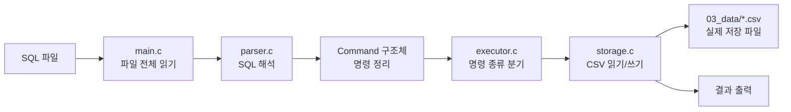
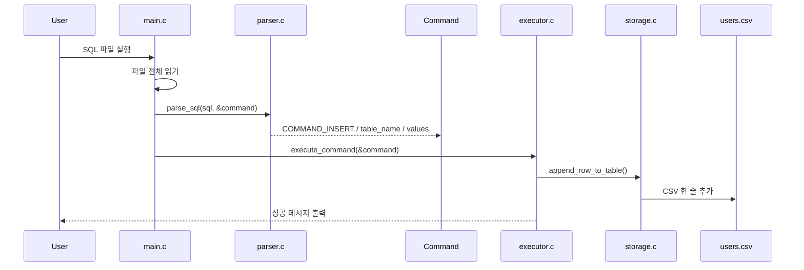
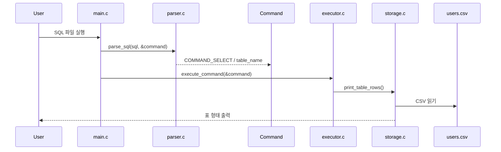

# Mini SQL Rebuild

SQL 파일을 입력받아 `INSERT`, `SELECT`를 해석하고, CSV 파일에 저장·조회하는 미니 SQL 처리기입니다.  
이 프로젝트는 단순히 기능을 구현하는 데서 끝나는 것이 아니라, **AI가 만든 코드까지 팀원 모두가 설명할 수 있을 정도로 이해하는 것**을 목표로 진행했습니다.

> 발표 기준 브랜치: `huiugim8`  
> 구조 확장과 설계 고민의 기준 브랜치: `woonyong-kr`

---

## 1. 어떤 프로젝트인가

이번 프로젝트는 C 언어로 만든 **파일 기반 SQL 처리기**입니다.

입력은 SQL 텍스트 파일이고, 프로그램은 이를 읽어서 다음 순서로 처리합니다.

```text
입력(SQL) -> 파싱 -> 명령 구조화 -> 실행 -> 저장 / 조회 출력
```

현재 발표 기준인 `huiugim8` 브랜치는 "SQL 처리기의 최소 동작 흐름을 이해하기 쉽게 다시 구현한 학습용 브랜치"입니다.

현재 지원 범위는 아래와 같습니다.

- `INSERT INTO ... VALUES (...)`
- `SELECT * FROM ...`
- CSV 기반 파일 저장
- SQL 파일 입력 실행
- 기능 테스트 스크립트

즉, 지금 브랜치는 **동작하는 최소 SQL 처리기**를 직접 다시 만들면서, 파싱과 실행, 저장의 흐름을 설명할 수 있게 만드는 데 집중했습니다.

---

## 2. 팀 목표

우리 팀의 목표는 단순히 결과물을 빠르게 완성하는 것이 아니라, **제안된 과제를 소스코드 수준까지 이해하는 것**이었습니다.

진행 방식은 아래와 같았습니다.

1. SQL의 기본 개념을 팀원끼리 먼저 정리했습니다.
2. 각자 AI를 활용해 최소 구현을 빠르게 만들어 보았습니다.
3. 만들어진 코드를 함께 비교하며, 로직을 직접 설명하는 시간을 가졌습니다.
4. 이후 흐름을 더 잘 이해할 수 있도록 파일과 역할을 다시 나누어 재구성했습니다.

즉, 이번 프로젝트는

- AI를 활용한 빠른 구현
- 생성된 코드를 직접 설명할 수 있을 정도의 이해

를 동시에 목표로 했습니다.

---

## 3. 전체 로직 구조

현재 브랜치의 핵심 실행 흐름은 아래와 같습니다.



한 줄로 요약하면:

> `입력(SQL)` -> `파싱` -> `명령 구조체` -> `실행기` -> `CSV 저장/조회`

---

## 4. 코드 구조

현재 브랜치는 흐름을 이해하기 쉽게 단계별 폴더 구조로 나누었습니다.

```text
01_insert_sql      INSERT 예제 SQL
02_select_sql      SELECT 예제 SQL
03_data            CSV 데이터 파일
04_common          공통 구조체와 타입
05_parser          파서 인터페이스
06_storage         저장소 인터페이스
07_executor        실행기 인터페이스
08_parser_impl     파서 구현
09_storage_impl    저장소 구현
10_executor_impl   실행기 구현
11_main            전체 연결
12_tests           테스트 스크립트
```

이 구조는 “기능을 한 번에 이해하기 어렵다면, 역할을 잘게 나눠서 설명 가능한 단위로 쪼개자”는 학습 전략을 반영한 것입니다.

---

## 5. 핵심 자료구조

현재 구현에서 가장 중요한 구조체는 `Command`입니다.

`04_common/common.h`

```c
typedef enum {
    COMMAND_UNKNOWN = 0,
    COMMAND_INSERT,
    COMMAND_SELECT
} CommandType;

typedef struct {
    CommandType type;
    char table_name[MAX_TABLE_NAME_LENGTH];
    char values[MAX_VALUES][128];
    int value_count;
} Command;
```

이 구조체는 SQL 문자열을 실행 가능한 명령으로 바꾼 **중간 표현**입니다.

- `type`: 어떤 명령인지
- `table_name`: 어느 테이블을 대상으로 하는지
- `values`: INSERT 값 목록
- `value_count`: 값 개수

즉, 파서가 문자열을 직접 실행하지 않고, 먼저 `Command` 구조체로 정리한 뒤 실행기에 넘기는 구조입니다.

---

## 6. 실제 실행 흐름

예를 들어 아래 SQL이 들어오면:

```sql
INSERT INTO users VALUES ('kim', 20);
```

내부 동작은 아래와 같습니다.



`SELECT`는 반대로 파일을 읽어서 화면에 출력합니다.



---

## 7. 협업 방식

이번 프로젝트는 4명이 함께 진행했습니다.

협업 방식은 아래와 같았습니다.

1. SQL의 기본 개념을 짧게 공유했습니다.
2. 각자 AI를 활용해 최소 구현 형태를 빠르게 만들어 봤습니다.
3. 만들어진 코드들을 비교하며 어떤 구조가 설명하기 쉬운지 논의했습니다.
4. 이후 한 파일씩 읽으면서, 각 파일의 역할과 로직을 직접 설명하는 시간을 가졌습니다.

즉 이번 협업의 핵심은 분업 자체보다,

> **생성된 코드를 같이 읽고, 서로 설명하며, 검증하는 과정**

에 있었습니다.

---

## 8. 구현하면서 든 고민과 현재 답

이번 프로젝트에서 가장 중요한 부분은 단순히 “무엇을 만들었는가”가 아니라, 구현 과정에서 어떤 구조적 고민이 생겼고, 그에 대해 어떤 답을 떠올렸는가였습니다.

### 고민 1. 명령어가 늘어나면 어떻게 처리해야 하나

처음에는 `INSERT`, `SELECT` 두 개뿐이라 단순 분기만으로도 충분했습니다.

하지만 실제 SQL은 다음처럼 계속 확장됩니다.

- `SELECT`
- `SELECT WHERE`
- `SELECT ORDER BY`
- `INSERT`
- `DELETE`
- `UPDATE`
- `CREATE TABLE`

이렇게 되면 문자열을 바로 분기 처리하는 방식은 금방 복잡해집니다.

#### 현재 답

입력을 바로 실행하지 않고, 먼저 **구조화된 명령 표현**으로 바꿔야 한다고 판단했습니다.

```text
입력 문자열 -> 토큰화 -> AST 또는 Command -> Executor -> Storage
```

현재 `huiugim8` 브랜치에서는 `Command` 구조체가 그 역할을 하고 있고,  
`woonyong-kr` 브랜치에서는 더 나아가 `AST + statement executor + storage engine` 형태로 분리하는 방향을 실험했습니다.

즉 현재 고민에 대한 답은:

> 명령어가 늘어날수록 문자열 분기보다 구조화된 명령 표현과 실행기 분리가 필요하다

입니다.

---

### 고민 2. 스키마 규칙은 어디까지 정의해야 하나

최소 구현에서는 단순히 CSV에 값을 넣고 읽는 것만으로도 동작합니다.  
하지만 실제 SQL 엔진처럼 생각하면 아래 규칙이 필요합니다.

- `PRIMARY KEY`
- 문자열 길이 제한
- `NOT NULL`
- 기본값
- 타입 검증

#### 현재 답

스키마는 단순 컬럼 이름 목록이 아니라, **제약조건까지 포함한 메타데이터**여야 한다고 생각했습니다.

즉 스키마는 나중에 최소한 이런 정보를 가져야 합니다.

- 컬럼명
- 타입
- 길이 제한
- PK 여부
- NULL 허용 여부
- 기본값

현재 발표 브랜치에서는 이 수준까지 구현하지 않았지만,  
`woonyong-kr` 브랜치에서는 `.schema`와 실행 검증 로직을 분리하는 방향으로 확장해 보았습니다.

즉 현재 고민에 대한 답은:

> 스키마는 단순한 컬럼 목록이 아니라, 실행 시점 검증에 필요한 규칙 메타데이터다

입니다.

---

### 고민 3. 컬럼 순서와 구조체 패딩 문제는 어떻게 봐야 하나

사용자가 정의한 컬럼 순서와 C 구조체의 실제 메모리 배치는 다를 수 있습니다.  
예를 들어 사용자는 다음 순서로 정의할 수 있습니다.

```text
id, name, age
```

그런데 내부적으로 메모리 효율을 위해 구조체 필드 순서를 바꾸고 싶을 수도 있습니다.  
이때 구조체 padding byte가 생길 수 있고, 사용자에게 보여주는 순서와 내부 저장 순서가 달라질 수 있습니다.

#### 현재 답

현재 시점에서 내린 답은:

> 사용자에게 보이는 순서(논리 스키마)와 내부 저장 표현(물리 표현)을 분리해야 한다

입니다.

작은 구현에서는 아래처럼 단순하게 갑니다.

```c
schema.columns[0] = "id";
schema.columns[1] = "name";
schema.columns[2] = "age";

row[0] = "1";
row[1] = "Alice";
row[2] = "24";
```

이 경우는 **논리 순서 = 저장 순서** 입니다.

하지만 더 큰 구조에서는 둘을 분리할 수 있습니다.

```text
논리 순서: [id, name, age]
물리 순서: [age, id, name]
```

그렇다면 아래 같은 매핑이 필요합니다.

```text
logical_to_physical
id   -> 1
name -> 2
age  -> 0
```

즉 출력은 항상 schema 순서대로 보여주되,
내부 저장은 별도의 물리 순서를 가질 수 있습니다.

이 방식의 핵심은:

- 사용자에게 보여주는 순서: schema 기준
- 내부 최적화 순서: engine 기준
- 둘의 연결: 매핑 정보

입니다.

그리고 구조체 padding 관점에서는 일반적으로 정렬 단위가 큰 필드를 앞에 두는 편이 유리합니다.

예:

- `double`, 포인터
- `int`
- `short`
- `char`

하지만 DB 저장 포맷은 결국 C 구조체 레이아웃에 그대로 의존하지 않는 쪽이 더 안전하다고 판단했습니다.

즉 현재 고민에 대한 답은:

> 구조체 메모리 배치에 사용자 스키마를 직접 묶지 말고, 논리 스키마와 물리 저장 표현을 분리한다

입니다.

---

### 고민 4. 그러면 사용자에게 보여주는 순서는 어떻게 유지하나

내부 최적화를 위해 저장 순서를 바꾼다면,  
사용자에게 보여줄 때 컬럼 순서를 어떻게 원래대로 보장할 수 있는지 고민했습니다.

#### 현재 답

답은 **schema가 논리 순서의 기준이 된다** 입니다.

즉,

- 저장할 때는 내부 순서로 저장할 수 있고
- 읽을 때는 schema 기준으로 다시 복원하고
- 출력할 때는 schema 순서대로 보여주면 됩니다

즉 현재 고민에 대한 답은:

> 사용자에게 보이는 순서는 schema가 책임지고, 내부 최적화는 엔진이 별도로 책임진다

입니다.

---

### 고민 5. 저장 방식은 결국 어디까지 가야 하나

현재는 CSV가 가장 단순하고 학습하기 좋습니다.  
하지만 다음 단계에서는 자연스럽게 이런 고민이 생깁니다.

- CSV의 한계는 무엇인가
- 이진 포맷으로 바꾸면 어떤 점이 좋아지는가
- 인덱스가 필요하다면 B+Tree는 어떻게 설계하는가
- 데이터와 인덱스는 함께 저장해야 하나, 나눠야 하나

#### 현재 답

현재 생각하는 가장 현실적인 답은:

> 테이블 데이터와 인덱스를 분리하는 방향이 자연스럽다

입니다.

예를 들어:

- 테이블 데이터 파일: 실제 row 저장
- 인덱스 파일(B+Tree): `key -> row 위치` 저장

즉 B+Tree는 보통 “데이터 자체”가 아니라 “데이터를 빨리 찾기 위한 구조”로 붙는 것이 자연스럽다고 정리했습니다.

따라서 저장 구조는 장기적으로 아래 단계로 확장될 수 있습니다.

1. CSV
2. custom binary format
3. heap file
4. B+Tree index
5. transaction / journal

즉 현재 고민에 대한 답은:

> CSV는 시작점이고, 이후에는 데이터 파일과 인덱스 구조를 분리하는 쪽으로 가는 것이 맞다

입니다.

---

## 9. 브랜치별 의미

| 구분 | `huiugim8` | `woonyong-kr` |
| --- | --- | --- |
| 역할 | 발표용 최소 구현 | 구조 확장과 설계 고민 반영 |
| 목적 | 흐름 학습 | 계층 분리와 확장 가능성 검토 |
| 지원 범위 | `INSERT`, `SELECT` | `INSERT`, `SELECT`, `CREATE TABLE`, `DELETE`, `DROP TABLE` 등 |
| 입력 방식 | SQL 파일 | 파일 + CLI + 인터페이스 분리 |
| 저장 방식 | CSV 단일 구현 | StorageEngine 추상화 |

발표는 `huiugim8` 브랜치로 진행하지만,  
우리가 어디까지 생각해 봤는지는 `woonyong-kr` 브랜치의 구조 고민을 함께 소개할 예정입니다.

---

## 10. 테스트와 검증

과제 요구사항에서 테스트는 꼭 필요했습니다.

현재 브랜치에서는 `12_tests/test.sh`를 통해 아래 흐름을 검증합니다.

1. 기존 CSV 백업
2. 테스트 데이터 초기화
3. 빌드
4. INSERT 실행
5. SELECT 실행
6. 테스트 종료 후 원본 복원

즉 단순히 프로그램이 실행되는지만 보는 게 아니라,

> 입력 -> 저장 -> 조회

전체 흐름이 실제로 이어지는지 확인합니다.

---

## 11. 발표 포인트

4분 발표라면 아래 흐름으로 설명할 계획입니다.

### 1. 프로젝트 소개

"C 언어로 만든 파일 기반 미니 SQL 처리기입니다."

### 2. 팀 목표

"우리는 결과물만이 아니라, 소스코드를 직접 설명할 수 있을 정도의 이해를 목표로 했습니다."

### 3. 현재 구현

- SQL 파일 입력
- `INSERT`
- `SELECT`
- CSV 저장/조회

### 4. 코드 흐름

`main -> parser -> Command -> executor -> storage`

### 5. 협업 방식

"각자 AI로 구현해 보고, 그 코드를 다시 설명하는 방식으로 학습했습니다."

### 6. 고민과 답

- 명령어 확장
- 스키마 옵션
- 구조체 패딩과 컬럼 순서
- B+Tree와 저장 구조

### 7. 마무리

"이 프로젝트는 단순 구현을 넘어서, DB 처리 흐름과 구조 설계까지 연결해 생각해 본 학습 프로젝트였습니다."

---

## 12. 데모 명령

```bash
make
./mini_sql_rebuild 01_insert_sql/insert_user.sql
./mini_sql_rebuild 02_select_sql/select_users.sql
```

또는

```bash
sh 12_tests/test.sh
```

---

## 13. 한 줄 정리

이 프로젝트는 **SQL 파일 입력을 파싱하고, 이를 명령 구조체로 바꾼 뒤, CSV 저장·조회로 연결하는 미니 SQL 처리기를 직접 구현하고, 그 구조와 확장 가능성까지 팀 전체가 이해해 보는 학습 프로젝트**입니다.
