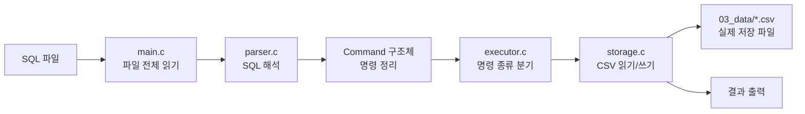
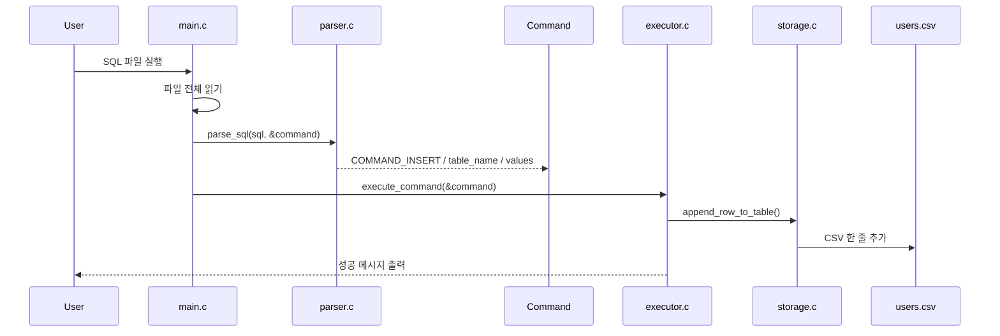
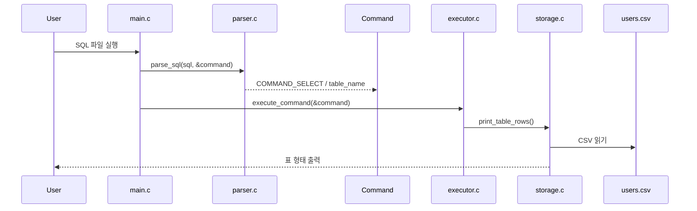

# Mini SQL Rebuild

6주차 주제 : SQL 파일을 입력받아 `INSERT`, `SELECT`를 해석하고, CSV 파일에 저장·조회하는 미니 SQL 처리기입니다.  

## 1. 2조 팀목표

이번 SQL 프로젝트를 시작할 때 저희 팀은 먼저 **두 가지 기준**을 세웠습니다.

1. SQL의 최소 구현을 직접 만들어 보는 것 
2. C 언어 문법과 파일 입출력 흐름에 익숙해지는 것

그래서 처음부터 완성도 높은 SQL 엔진을 목표로 하기보다는, 작더라도 직접 설명할 수 있는 최소 구현을 만드는 방향으로 출발했습니다.

즉, 이번 프로젝트의 팀 플랜은 아래처럼 정리할 수 있습니다.

- 오전    : SQL의 최소 구현을 직접 만든다
- 오후    : C 언어와 파일 처리 흐름에 익숙해진다
- 오후 7시 : 각자 작성한 코드를 발표하고 리뷰한다
- 이후    : 모르는 부분은 팀원끼리 공유하면서 함께 수정한다

이는 각자 구현한 코드를 그냥 제출하는 것이 아니라 각자의 코드를 발표하고 리뷰하면서 서로 모르는 부분을 공유하는 방식을 택한 것이었습니다.


---

## 2. 이번 발표 코드에서 제가 배운 점

오늘 발표하는 제 코드도 처음부터 완성된 구조는 아니었습니다.

처음 최소 구현만 빠르게 맞추다 보니, 제 코드의 초기 버전은  
**스키마를 따로 두지 않고 바로 값을 저장하는 형식**이었습니다.

하지만 팀원들의 코드 리뷰를 들으면서,  
단순히 동작만 하는 것보다 "데이터를 어떤 기준으로 이해하고 저장할 것인가"가 더 중요하다는 점을 배웠습니다.

코드리뷰 과정에서 전체코드 진행하였고,팀원들과 함께 구조를 수정하면서 스키마와 데이터 해석 기준을 보완하게 됐습니다.

즉, 이번 발표 코드의 핵심은 단순히 제가 혼자 구현한 결과물이 아니라,

- 최소 구현으로 먼저 시작하고
- 코드 리뷰를 통해 부족한 점을 발견하고
- 팀 논의를 거쳐 구조를 수정했다

는 과정 자체에 있습니다.

---

## 3. 어떤 프로젝트인가

이번 프로젝트는 C 언어로 만든 **파일 기반 SQL 처리기**입니다.

입력은 SQL 텍스트 파일이고, 프로그램은 이를 읽어서 다음 순서로 처리합니다.

```text
입력(SQL) -> 파싱 -> 명령 구조화 -> 실행 -> 저장 / 조회 출력
```
현재 지원 범위

- INSERT
- SELECT
- CSV 기반 파일 저장
- SQL 파일 입력 실행

즉, 지금 브랜치는 **동작하는 최소 SQL 처리기**를 직접 다시 만들면서, 파싱과 실행, 저장의 흐름을 설명할 수 있게 만드는 데 집중했습니다.

---

## 3. 전체 로직 구조

현재 브랜치의 핵심 실행 흐름은 아래와 같습니다.



한 줄로 요약하면:

> `입력(SQL)` -> `파싱` -> `명령 구조체` -> `실행기` -> `CSV 저장/조회`

---

## 4. 코드 구조

현재 브랜치는 흐름을 이해하기 쉽게 단계별 폴더 구조를 다음과 같이 나누었습니다.

```text
01_insert_sql      INSERT 예제 SQL
02_select_sql      SELECT 예제 SQL
03_data            CSV 데이터 파일
04_common          공통 구조체와 타입
05_parser          파서 인터페이스
06_storage         저장소 인터페이스
07_executor        실행기 인터페이스
08_parser_impl     파서 구현
09_storage_impl    저장소 구현
10_executor_impl   실행기 구현
11_main            전체 연결
12_tests           테스트 스크립트
```
이 구조는 순서대로 각 파일의 역할을 나눠 이해했고, 마지막에는 main에서부터 역으로 따라가며 전체 흐름을 정리하는 학습 전략을 반영한 것입니다

---

## 5. 핵심 자료구조

이번 구현에서 가장 중요한 구조체는 `Command`입니다.

`04_common/common.h`

```c
typedef enum {
    COMMAND_UNKNOWN = 0,
    COMMAND_INSERT,
    COMMAND_SELECT
} CommandType;

typedef struct {
    CommandType type;
    char table_name[MAX_TABLE_NAME_LENGTH];
    char values[MAX_VALUES][128];
    int value_count;
} Command;
```

“저희 Command 구조체는 동적 메모리를 쓰지 않는 정적 구조입니다. 
최소 구현 단계이기 때문에 명령 종류와 값 개수를 고정 크기 배열로 단순하게 표현했습니다.”
이부분또한 동료들의 피드백으로 알게된사실이며 팀회의를 통해 동적메모리와 정적인메모리중 최소구현에는 정적인메모리가 팀목표에 맞기에 결정하였습니다.

- `type`: 어떤 명령인지
- `table_name`: 어느 테이블을 대상으로 하는지
- `values`: INSERT 값 목록
- `value_count`: 값 개수

즉, 파서가 문자열을 직접 실행하지 않고, 먼저 `Command` 구조체로 정리한 뒤 실행기에 넘기는 구조입니다.

---
## 6. 데모

발표 시연은 아래 블록을 그대로 순서대로 복붙해서 진행합니다.

```bash
make cli
```

```sql
SELECT * FROM materials;
```

```sql
INSERT INTO materials VALUES ('크래프톤', '정글', '이동석코치님', '짱짱');
```


```sql
SELECT * FROM materials;
```

## 7. 실제 실행 흐름

예를 들어 아래 SQL이 들어오면:

```sql
INSERT INTO users VALUES ('kim', 20);
```

내부 동작은 아래와 같습니다.



`SELECT`는 반대로 파일을 읽어서 화면에 출력합니다.



### 8. 마무리

이번 프로젝트를 진행하면서 단순히 기능을 구현하는 것 이상으로, 명령어 구조화 방식, 스키마 설계, 컬럼 순서와 물리 저장 표현의 분리, 그리고 명령어 처리를 위한 추상화 등 
C 구조에서 저장 엔진이 어떤 방향으로 확장되어야 하는지까지 자연스럽게 고민하게 됐습니다.

답을 찾진 못했지만 차주에는 인덱싱 구현을 주제로 팀원들과 다시 논의해보면서, 이번에 정리한 고민들을 실제 코드로 검증해보고 싶습니다.
